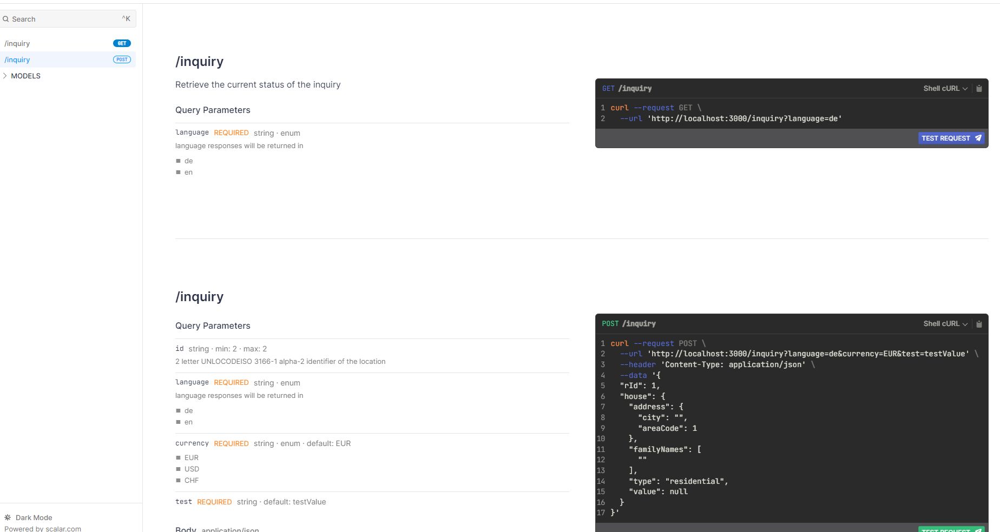

# Hono-Openapi<!-- omit from toc -->

Hono Openapi is a drop in zero configuration extension for [Hono](https://github.com/honojs/hono).
It automatically generates [OpenApi](https://swagger.io/specification/) documentation which is exposed via the modern [Scalar](https://github.com/scalar/scalar) frontend or the traditional [Swagger Ui](https://github.com/swagger-api/swagger-ui).

Furthermore, it offers enhanced functionalities such as accurate request validation powered by [typebox](https://github.com/sinclairzx81/) and automatic response schema generation through introspection.

Contrary to the official [hono typebox-validator](https://github.com/honojs/middleware/tree/main/packages/typebox-validator) request types are correctly coerced into the target type.

## Getting started

Install dependencies

```bash
bun add @hono-openapi/core hono @sinclair/typebox
```


```ts
import { Hono } from '@hono-openapi/core';

const app = new Hono();
app.get('/foo', (c) => c.text('OK'));
app.get('/foo/:parameter', (c) => c.json({}));

export default app;
```

Navigate to http://localhost:3000/swagger to view the documentation. All routes that are added to the Hono instance will be present in the documentation by default and route parameters are automatically picked up.


## Table of contents<!-- omit from toc -->

- [Getting started](#getting-started)
- [Parameters](#parameters)
- [Examples](#examples)
  - [Request validation](#request-validation)
  - [Advanced Request validation example](#advanced-request-validation-example)
  - [Response schema generation](#response-schema-generation)
  - [Export OpenApi document](#export-openapi-document)
  - [Additional openapi parameters](#additional-openapi-parameters)
  - [Switching out frontend e.g. use (swagger ui)](#switching-out-frontend-eg-use-swagger-ui)
  - [Custom validation error callback](#custom-validation-error-callback)
  - [Exclude certain routes](#exclude-certain-routes)
  - [Renaming Schema models](#renaming-schema-models)
- [Advantages](#advantages)
- [Known limitations](#known-limitations)


## Parameters

| option        | values                                                                       | default   | description                                                                                                                                                                  | Example | 
| ------------- | ---------------------------------------------------------------------------- | --------- | ---------------------------------------------------------------------------------------------------------------------------------------------------------------------------- | ---- |
| excludePaths  | string \| RegExp \| (string \| RegExp)[]                                     | undefined | A list of routes that will be omitted when creating the documentation                                                              | [Example](#exclude-certain-routes)                                                                                          |
| excludeMethod | string \| string[] `option`\|`get`\|`post`\|`delete`\|`patch`\|`post`\|`put` | `option`  | routes with the http verbs will not be included in the open api documentation. By default option routes are omitted. In order to display `option` routes pass an empty array | [Example](#exclude-certain-routes) | 
| inSpecPath    | string / filehandle                                                          | undefined | Path to openapi file which will be used as a template. (.json / .yaml) | [Example](#renaming-schema-models) |
| validationResponse | object  |                                                               | undefined |                                                                        | [Example](#custom-validation-error-callback)|
| validationResponse.errorCode | number                                                        | 400       | Http error code to return in case that validating request parameters fails | |
| validationResponse.validationCallback | (c:Context, Record<string, ValueError[]>) => Response | undefined                                                       | Callback method invoked on validation error. Return a response object to alter the response send to the caller | |
| responseSampling | object                                                                     | undefined | if defined introspect the responses and generate a response schema of all returned responses | | 
| 
| verbose       | boolean                                                                      | false     | print debug information. Mostly for development.                                                                                                                                        |
|
|

## Examples

### Request validation

Hono-Openapi builds upon typebox for request validation. If you are using the hono typebox validator you can just reuse your existing schemas.  
The openApi middleware allows you to specify additional documentation and validation. A 400 response status will be returned

```typescript

import { Hono, openApi } from '@hono-openapi/core';
import { Type } from '@sinclair/typebox';

const app = new Hono();

//The outermost type should always be an object
const fooQuery = Type.Object({
  languageCode: Type.String({
    examples: 'en',
  }),
});

app.post(
  '/foo',
  //Use the openApi middleware for validation
  openApi({
    query: fooQuery,
  }),
  (c) => {
    const { languageCode } = c.req.valid('query');
    return c.text(languageCode);
  }
);

export default app;
```

#### Result


#### Response

A **400** response will be returned in case that the specified query parameter is missing.

```json
{
  "success": false,
  "description": "Bad request. One or more fields did not pass validation",
  "errors": {
    "query": [
      {
        "type": 45,
        "schema": {
          "examples": "en",
          "type": "string"
        },
        "path": "/languageCode",
        "message": "Required property"
      },
      {
        "type": 54,
        "schema": {
          "examples": "en",
          "type": "string"
        },
        "path": "/languageCode",
        "message": "Expected string"
      }
    ]
  }
}
```

#### Further hints and best practices

```ts
 openApi({
    //Query parameter
    query: fooQuery,
    //Header values always lowercase
    header: fooQuery,
    //Body for json data
    json: fooQuery,
    //Body for FormData
    form: fooQuery,
    //Cookie values
    cookie: fooQuery,
    //Path variables. e.g. /foo/:id
    param: fooQuery,
  }),
```

- Always access variables with the `valid` property. Use `c.req.valid('json')` instead of e.g. `c.req.json`, this grants you type hints as well as correctly coerces data types.

```ts
app.post(
  '/foo',
  openApi({
    header: Type.Object({
      id: Type.Number(),
    }),
  }),

  (c) => {
    //Correct. This grants access to intellisense and proper casting
    const { id } = c.req.valid('header');
    //avoid this!
    const idViaHeader = c.req.header('id');

    typeof id; //number;
    typeof idViaHeader; //string

    return c.text('');
  }
);
```

- Contrary to the [official typebox validator](https://github.com/honojs/middleware/tree/main/packages/typebox-validator) types are correctly casted and default values are respected

- According to [RFC7230 specification](https://www.rfc-editor.org/rfc/rfc7230#appendix-A.2) header fields are case insensitive. Hono honors this by lowercasing incoming header names. Hono-OpenApi will throw an error if a schema with uppercase letters as parameter names is passed as validation would never pass.

- Schema types can be reused in different endpoints, or recreated. The openApi middleware attempts to reuse already existing schemas if they are deep equal in order to minimize the created schemas in the openAi document.

- `Type.String()` on it's own might evaluate to an empty string `''`. You usually should specify a `minimum length` as well as examples for better error messages.

### Advanced Request validation example


<table>
    <tr>
        <th>
        </th>
        <th>
            Example
        </th>
        <th>
            Typescript
        </th>
    </tr>
    <tr>
        <td>
            Optional
        </td>
        <td>

  ```ts
/**
  *  Optional description for Intellisense
  */
 id: Type.Optional(
    Type.String({
      minLength: 2,
      maxLength: 2,
      description: '2 letter UNLOCODEISO 3166-1 alpha-2 identifier of the location',
      examples: 'de',
    })
  )
 ```
</td>
<td>
    
</td>
</tr>
    <tr>
        <td>
            Enum / Literal values
        </td>
        <td>

  ```ts
language: TEnum(['de', 'en'], {
    description: 'language responses will be returned in',
  }),
 ```
</td>
<td>
    </br>
    Enums are a custom extension of the type system. They are not imported from the Typebox System but rather from <code>@hono-openapi/core</code>. Do <b>not</b> use the <code>Type.Enum</code> import! Enums can contain numbers or strings, but mixing strings and enums is currently not supported.
</td>
</tr>
</tr>
    <tr>
        <td>
            A | B
        </td>
        <td>

  ```ts
value: Type.Union([
    Type.Object({
      fixPrice: Type.Number({
        description: 'price'
       }),
       currency: TEnum(['EUR', 'USD']),
      }),
    Type.Object({
      optionalPrice: Type.Number(),
      expiration: Type.Date(),
    }),
]),
 ```
</td>
<td>
    </br>
</td>
</tr>

</table>

For a full referernce list see the table at the [typebox readme](https://github.com/sinclairzx81/typebox?tab=readme-ov-file#types).


<details>

<summary>Click for complex example</summary>

````ts
const app = new Hono();

//We will reuse this part of the schema throughout multiple instances
const LanguageSchema = TEnum(['de', 'en'], {
  description: 'language responses will be returned in',
});

const CurrencySchema = TEnum(['EUR', 'USD', 'CHF'], {
  default: 'EUR',
});

//Query schemas are not nested.
const InquiryQuery = Type.Object({
  id: Type.Optional(
    Type.String({
      minLength: 2,
      maxLength: 2,
      description:
        '2 letter UNLOCODEISO 3166-1 alpha-2 identifier of the location',
      examples: 'DE',
    })
  ),

  language: LanguageSchema,
  currency: CurrencySchema,
  test: Type.String({
    default: 'testValue',
  }),
});

// Body payloads can be nested.
const InquiryBody = Type.Object({
  rId: Type.Number(),
  house: Type.Object({
    address: Type.Object({
      city: Type.String({
        minLength: 4,
        examples: 'Cologne',
      }),
      areaCode: Type.Number({
        examples: 123456,
      }),
    }),
    familyNames: Type.Array(Type.String(), {
      description: 'Surname of families living in the house',
    }),
    type: TEnum(['residential', 'commercial']),
    value: Type.Union([
      Type.Object({
        fixPrice: Type.Number({ description: 'price' }),
        currency: CurrencySchema,
      }),
      Type.Object({
        optionalPrice: Type.Number({ description: '' }),
        expiration: Type.Date(),
      }),
    ]),
  }),
});

app.get(
  '/inquiry',
  openApi({
    query: Type.Object({ language: LanguageSchema }),
  }),
  (c) => {
    return c.text('OK');
  }
);

app.post(
  '/inquiry',
  openApi({
    query: InquiryQuery,
    json: InquiryBody,
  }),
  (c) => {
    const q = c.req.valid('query');
    const { house } = c.req.valid('json');
    return c.json(q);
  }
);

````



</details>


### Response schema generation

When the `responseSampling` property is set responses are introspected and response schemas are automatically generated. 

```ts

const app = new Hono({
  responseSampling: {
    samplingMode: 'individual',
    //Maximum number of requests to check. Afterwards new responses will be ignored. Default: infinity
    samplingMaxCount: 10,
    //[0-1] fraction of requests to take a look at. Default: 1, every request
    samplingInterval: 1,
  },
});

const accountPathSchema = Type.Object({
  id: Type.Number({
    description: 'Account number of customer'
  }),
});

app.get(
  '/account/:id',
  openApi({
    param: accountPathSchema,
  }),
  async (c) => {
    const { id } = c.req.valid('param');

    if (id === 0) {
      return c.text('Sorry. You are not permitted to access account id 0', 401);
    }

    if (id > 5) {
      return c.json({
        id: id,
        name: 'Smith',
        balance: Math.random(),
      });
    } else {
      return c.json({
        id: id,
        balance: Math.random(),
        premiumFeatures: {
          overdraftProtection: true,
          secondCard: false,
        },
      });
    }
  }
);

//Issue a few requests against the server. We could also just wait for requests to arrive. 
for (let i = 0; i < 100; i++) {
  await app.request(`/account/${i}`);
}

//Force a 400 validation error
await app.request('/account/noNumber');

```

Open the `/swagger` endpoint and take a look at the generated schema.


Upon restart the introspected responses are lost, so make sure to save the swagger json before restarting the server. See  [Renaming Schema models](#renaming-schema-models) as an example on how to do this.

| Sampling mode |  | |
| --- | --- | ---  |
| individual | Individual sampling creates a new model instance every time the structure differs. This sampling method gives an overview of all potential responses that might be returned, but also may result in bloated definitions in case that a lot of values are optional.  |  |
| combine | All potential fields are declared in a single response. Inside the require field it can be seen which fields are present in all sampled responses. "required": ["type","name","locode"]. This version is more compact but might not show the true picture of which variable combinations can be expected   |  |
| smart | Not yet implemented. Be smart and use heuristics to reuse parts of schemas and combine the strenghts of individual and combine schema generation | |

### Export OpenApi document

The OpenApi yaml file can be exported by either navigating to the `/swagger.json` endpoint or programmatically. If a path ending with `.json` is given a json document will be saved, else it will be exported as yaml no matter the extension specified

```ts
  const app = new Hono();
  app.saveOpenAPI31Document('./swagger.yaml')
```

### Additional openapi parameters

Besides automatically inferring data it is also possible to manually provided information 
for the openapi doc with full intellisense support.

```ts
//Main instance
const app = new Hono({
  openApi: {
    info: {
      title: 'Secret API',
      version: '0.0.0',
      contact: {
        name: 'Kilian',
      },
    },
    tags: [{
      name: 'customerCare',
      description: 'Publicly accessible endpoints for the customer'
    }]
  }
});


//Middleware
app.get(
  '/account/:id',
  openApi({
    //Documentation
    summary: 'Account Retrieval',
    description: 'Get information related to a customer account based on the public id. This information is ...',
    tags: ['customerCare'],

    //Validation
    param: accountPathSchema,
  }),
  async (c) => {
   ...
  }
);


```

This currently hasn't been thoroughly tested. Please open an issue if you encounter any unexpected behavior.

### Switching out frontend e.g. use (swagger ui)

The frontend consuming the OpenApi doc can be exchanged. Out of the box `scalar` and `swaggerUi` bindings exist with scalar being the default.

In order to use swagger install the optional dependency and register the renderer.

````bash
bun add @hono-openapi/swaggerui
````

```ts
 app.registerOpenApiRenderer(swaggerUi({}));
```

You can easily implement a renderer yourself. Just create a function which implements the `serve` method of the OpenApiRenderer and returns html content to show to the user.

````ts
export interface ProviderServeOptions {
    /** Path to the openapi.json spec file */
    swaggerJsonUrl: string;
    /** Hono Request context of the get request of the GET browser wanting to display the page */
    context: Context;
    /** Currently unused. Maybe useful in the future to allow editing the openapi doc file from the frontend */
    renameModelCallback: (oldName: string, newName: string, headingId: string) => void;
}
/**
 * OpenApiProviders are plugins that get called when the documentation page is requested.
 * This can be used to adjust the design of the created documentation or decide how the generated
 * spec file will be consumed.
 */
export interface OpenApiRenderer {
    /**
     * Callback that is responsible to return a website or other option to consume the generated openapi spec.
     * The return of this method is directly returned from the hono route handler and acts as a normal registered route endpoint.
     *
     * Most likely scenarios are returning html files that are embedding the spec files.
     *
     * @param options
     * @returns anything that can be served via hono.
     */
    serve: (options: ProviderServeOptions) => HandlerResponse<any>;
}

````

### Custom validation error callback

The shape of the response or status code in case of a failed validation can be tweaked with the `validationResponse` property.

````ts
const app = new Hono({
  validationResponse: {
    errorCode: 410,
  },
});

//or a bit more control with a callback

const app = new Hono({
  validationResponse: {
    validationCallback: async (c, validationErrors) => {
      //Log the response

      //if a response is returned it will be returned instead of the default response
      return c.json(
        {
          tea: 'is boiling',
        },
        418
      );
    },
  },
});

````


### Exclude certain routes

By default `OPTIONS` routes are excluded in the OpenApi document. To display those pass an empty array to the excludeMethod parameter.

````ts
//Include options methods
const app = new Hono({
  excludeMethod: []
});
````

Exclude `GET` and `OPTIONS` for the locations endpoint
````ts

const app = new Hono({
  excludeMethod: ['get','options'],
  excludePaths: '/locations'
});
````

Exclude path with param
  
````ts
const app = new Hono({
  excludeMethod: ['get','options'],
  excludePaths: '/location/:id'
});

app.get('/location/:id', ...)
````

Exclude multiple routes

````ts
const app = new Hono({
  excludeMethod: ['get','options'],
  excludePaths: ['/locations','/areas']
});
````

Regex Support.
If you get unexpected results remember that `RegExp.test(routePath)` is called which in the below 
example just checks if location is included. Try to add `$` and `^` when in doubt.

In the following all routes would be excluded

````ts
const app = new Hono({
  excludeMethod: ['get','options'],
  excludePaths: [/locations/,'/areas']
});

app.get('/locations', (c) => {
  return c.text('');
});

app.get('/foo/locations', (c) => {
  return c.text('');
});

app.get('/foo/locations/bar', (c) => {
  return c.text('');
});

app.get('/allmostlocations', (c) => {
  return c.text('');
});

````

e.g. `excludePaths: /locations$/` will omit all routes that end on /locations

#### Route merging

When grouping routes and mounting them be careful that only the settings of the parent app is respected. Any exclusion options added to the `privateApp` are not respected.

```ts
const app = new Hono({
  excludePaths: /private\//
});

const privateApp = new Hono();
privateApp.get('/secret', (c) => {
  return c.json({});
});

app.route('/private', privateApp);
```


### Renaming Schema models

Generated response schemas follow a specific syntax to avoid naming conflicts. A common use case is the need to rename those models. In the future we want to be able to rename those models from the frontend, for now a bit of a manual process is involved.

1. Generate the route definitions by hand or by running the project.

````typescript

const app = new Hono({
  responseSampling: {
    samplingMode: 'individual',
  },
});

//Multiple route handlers
app.post(
  '/location',
  openApi({
    description: 'My Foo',
  }),
  (c) =>
    c.json({
      lat: 50.93,
      lng: 7,
      name: 'Cologne',
      locode: 'DE CGN',
    })
);

//... call the location endpoint to generate the base schema

app.get('/saveDoc', (c) => {
  app.saveOpenAPI31Document('./spec.yaml');
  return c.text('File saved to disc');
});
````

   1. Open the spec file and change the model name and reference as you please.

````diff
openapi: 3.1.0
info:
  title: OpenApi Spec
  version: 0.0.0
components:
  schemas:
-    LocationResponse_post_application_json_200:
+    Location:
      type: object
      properties:
        lat:
          example: 50.93
          type: number
        lng:
          example: 7
          type: number
        name:
          example: Cologne
          type: string
        locode:
          example: DE CGN
          type: string
      required:
        - lat
        - lng
        - name
        - locode
paths:
  /location:
    post:
      description: My Foo
      operationId: postLocation
      parameters: []
      responses:
        "200":
          description: Success
          content:
            application/json:
              schema:
-                $ref: "#/components/schemas/LocationResponse_post_application_json_200"
+                $ref: "#/components/schemas/Location"
                x-openapi-sample-count: 1
  /saveDoc:
    get:
      operationId: getSaveDoc
      parameters: []
      responses: {}

````

Now add the `inSpecPath` argument to the hono instance to start with an already existing definition file and you are good to go. With this way you can manually make changes to the swagger file which should be respected. 

If an openApi Middlewarehandler is present on a route the input parameter section will be overwritten as the spec file should be in line with the validation handlers. 

````typescript

const app = new Hono({
  inSpecPath: './spec.yaml',
  responseSampling: {
    samplingMode: 'individual',
  },
});
````


## Advantages

- More concise type hints
- Automatic generation of swagger definition without any code changes
- Auto generation of response type via introspection of return values
- No need to use multiple validators to perform validations on multiple sections (e.g. query, json, cookie, header)
- Scalar or Swaggerui


## Known limitations

- app.all is currently not supported.
- Partial response schemas currently are not reused. 